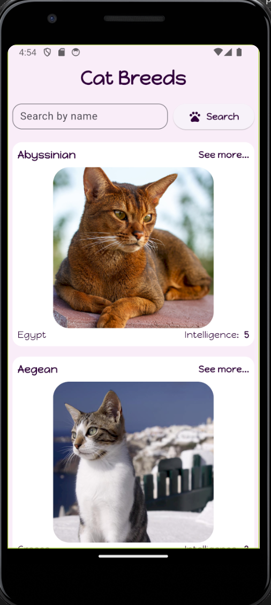

# catbreeds

# Introducción
La aplicación mostrará una lista de razas de gatos obtenida de una API. Al hacer clic en una raza de gato, se mostrarán los detalles de esa raza, incluyendo su nombre, origen, descripción, nivel de inteligencia y una imagen representativa.

Características
Funcionalidad	Descripción
Lista de razas de gatos	Muestra información detallada de las razas.
Detalles del personaje	Proporciona detalles al hacer clic en la lista.

Requisitos Previos
Asegúrate de tener instalados los siguientes requisitos previos antes de comenzar:

Flutter SDK
Git
Instalación
Clone el repositorio:

git clone [https://github.com/tu-usuario/rick_and_morty_app_gtc.git](https://github.com/shanexon98/catBreeds/tree/main)
Ingrese al directorio del proyecto:

cd cat_breeds
Instale las dependencias:

flutter pub get
Ejecute la aplicación:

flutter run

